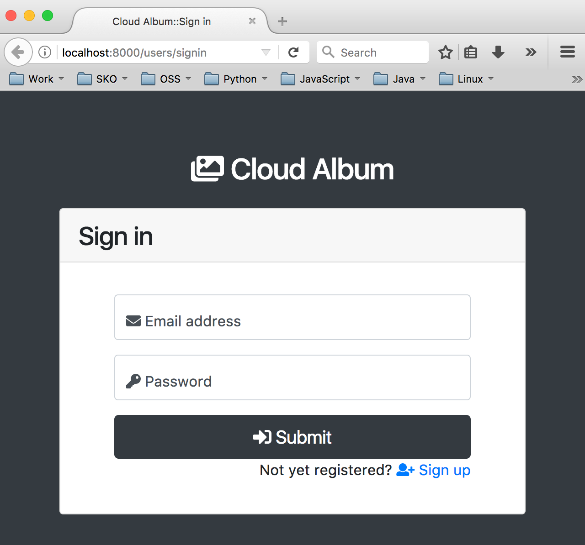
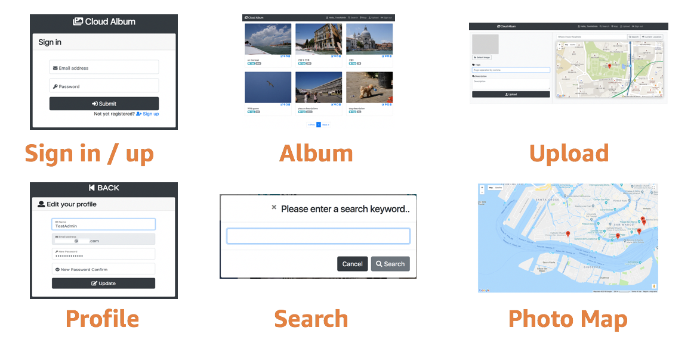

# LAB 01 - Take a look around

In this hands-on lab, you'll configure the **AWS [Cloud9](https://aws.amazon.com/cloud9/)** service to look around legacy application. You can run application 'CloudAlbum' in the AWS Cloud9 EC2 instance.

**GoGreen** company provides a hosted photo image album services (CloudAlbum) to it's end user. Customer access the web application to :

* To watch their personal photos with internet access.
* Upload photos to the CloudAlbum service for photo management.
* Track geolocation of uploaded photos


**CloudAlbum** has a general three-tier architecture.


The application has following software stack.


Legacy application is **not Restful** and application backend is **tightly coupled with Jinja2** Template Engine.


It has following several features.


## Prerequisites
The following prerequistied are required for the workshop:

* AWS Console Access
* AWS CLI installed and configured on your EC2 or PC. (`AdministratorAccess` recommended)
* An EC2 SSH Key-Pair (Optional)


## TASK 1. Create AWS Cloud9 environment and explore the environment.

In this section, you will create an AWS Cloud9 environment and explore the environment.

1. In the AWS Console, click **Services**, then click **Cloud9** to open the Cloud9 dashboard.

2. You can choose **Singapore** region.

3. Click **Create environment** at the top-right corner.

4. For **Name**, type **workshop-\<INITIAL\>** (or anything you want)

5. Click **Next step.**

6. On the **Configure settings** page, leave the default selection in the Environment settings section.(If you want, you can choose a **high-performance instance**.)

7. Click Next step.

8. Review the details and click **Create environment**. This should launch your AWS Cloud9 environment in a few minutes.

9. Upon environment creation, notice the **terminal window on the bottom pane**. The terminal provides a remote login to the instance on which the AWS Cloud9 environment is hosted, just as you used SSH for remote login. A **pre-authenticated AWS CLI** is installed in your terminal.

10. Explore the terminal by typing this command: 

```console
aws ec2 describe-instances
``` 
* Is it works well? Cool. Go to next step.

```console
sudo pip-3.6 install boto3
```

11. At the terminal, type **python3** and press ENTER.

12. For the confirmination, try the Python Boto 3 APIs by executing these commands:


```python
import boto3
client = boto3.client('ec2')
client.describe_instances()
```


13. Press **CTRL+D** to exit the Python interpreter.

**NOTE :** You can also use **virtualenv** for your project. Please refer following links. In this LAB doesn't use **virtualenv** for the convinience.

* https://docs.aws.amazon.com/ko_kr/cloud9/latest/user-guide/sample-python.html#sample-python-install

* https://docs.aws.amazon.com/ko_kr/cloud9/latest/user-guide/sample-python.html#sample-python-run


## TASK 2. Look around legacy application and try run it.

Check out the workshop repository from the Github.

```console
cd ~/environment
```
```console
git clone https://github.com/liks79/aws-chalice-migration-workshop.git
```

14. Install the requirements for the project by executing the command below in your AWS Cloud9 terminal.

```console
sudo pip-3.6 install -r ~/environment/aws-chalice-migration-workshop/LAB01/CloudAlbum/requirements.txt
```

15. Check the **config.py** Open this file in **Cloud9 terminal window** or **Cloud9 IDE editor**.

```console
vi ~/environment/aws-chalice-migration-workshop/LAB01/CloudAlbum/cloudalbum/config.py
```


```python
import os

conf = {
    # Mandatory variable
    'GMAPS_KEY': os.getenv('GMAPS_KEY', None),
    'DB_URL': os.getenv('DB_URL', None),

    # Default config values
    'APP_HOST': os.getenv('APP_HOST', '0.0.0.0'),
    'APP_PORT': os.getenv('APP_PORT', 8080),
    'FLASK_SECRET': os.getenv('FLASK_SECRET', os.urandom(24)),
    'SESSION_TIMEOUT': os.getenv('SESSION_TIMEOUT', 30),
    'SQLALCHEMY_TRACK_MODIFICATIONS': os.getenv('SQLALCHEMY_TRACK_MODIFICATIONS', False),
    'DB_ECHO_FLAG': os.getenv('DB_ECHO_FLAG', True),
    'DB_POOL_SIZE': os.getenv('DB_POOL_SIZE', 10),
    'DB_MAX_OVERFLOW': os.getenv('DB_MAX_OVERFLOW', 20),
    'DB_SQLALCHEMY_POOL_TIMEOUT': os.getenv('DB_SQLALCHEMY_POOL_TIMEOUT', 15),
    'DB_SQLALCHEMY_POOL_RECYCLE': os.getenv('DB_SQLALCHEMY_POOL_RECYCLE', 7200),
    'LOG_FILE_PATH': os.getenv('LOG_FILE_PATH', os.path.join(os.getcwd(), 'logs')),
    'LOG_FILE_NAME': os.getenv('LOG_FILE_NAME', 'cloudalbum.log'),
    'ALLOWED_EXTENSIONS': ['jpg', 'jpeg'],
    'UPLOAD_FOLDER': os.getenv('UPLOAD_FOLDER', os.path.join(os.getcwd(), 'upload')),
    'LOGGING_FORMAT': os.getenv('LOGGING_FORMAT', '%(asctime)s %(levelname)s: %(message)s in [%(filename)s:%(lineno)d]'),
    'LOGGING_MAX_BYTES': os.getenv('LOGGING_MAX_BYTES', 100000),
    'LOGGING_BACKUP_COUNT': os.getenv('LOGGING_BACKUP_COUNT', 1000),
    'LOGGING_LEVEL': os.getenv('LOGGING_LEVEL', 'debug'),
    'PER_PAGE': os.getenv('PER_PAGE', 6),
    'THUMBNAIL_WIDTH': os.getenv('THUMBNAIL_WIDTH', 300),
    'THUMBNAIL_HEIGHT': os.getenv('THUMBNAIL_HEIGHT', 300),
}
```
* The second parameter of **os.getenv** function is the default value to use when the **first parameter does not exist.**

16. Check the following variables in **config.py**.
    * **GMAPS_KEY** and **DB_URL**  variables are mandatory for this application.
    * **You will set up these values in step 23**

```python
    # Mandatory variable
    'GMAPS_KEY': os.getenv('GMAPS_KEY', None),
    'DB_URL': os.getenv('DB_URL', None),
```


17. Check the **ALLOWED_EXTENSIONS** : **Only JPG** files are allowed. (in **config.py**)

18. Setup these variables **before run** this application.

19. Select **aws-chalice-migration-workshop/LAB01/CloudAlbum/run.py** in the tree view.

20. First, **open the run.py**(double click), and on the top menu bar, click **Run → Run With → Python 3**. Ensure that you are using the **Python 3 runner**, as shown in the screenshot below.


21. You may fail due to following reason.

```console
DB_URL or GMAPS_KEY are not configured!
Check your environment variables!
```

22. To successfully run the code, you will need to **set environment variables.** To do so, follow the instructions below.


23. On the right side of the Run Configuration pane at the bottom, click **ENV**, as in the screenshot below.


24. First, In the **Name column**, type **DB_URL**. In the Value column, type the **SQLITE** file DB URL (*for the test purpose only*) like this. **DB table will be created automatically** via [SQLAlchemy](https://www.sqlalchemy.org/).

```python
sqlite:////home/ec2-user/environment/aws-chalice-migration-workshop/LAB01/sqlite.db
```

* **ALTERNATIVE WAY:** You can set the **DB_URL** value directly in `config.py`.
```python
'DB_URL': os.getenv('DB_URL', 'sqlite:////home/ec2-user/environment/aws-chalice-migration-workshop/LAB01/sqlite.db'),
```

25. Second, in the **Name column**, type **GMAPS_KEY**. In the Value column, type the **Google MAP API KEY** (**Temporary API Key** will be provided to the workshop attendees by presenter).

* **ALTERNATIVE WAY:** You can set the **GMAPS_KEY** value directly in `config.py`.
```python
'GMAPS_KEY': os.getenv('GMAPS_KEY', 'REAL_GMAPS_KEY_PROVIDED_BY_INSTRUCTOR'),
```


**NOTE:** You can issue **your own Google Maps API Key**, refer to following links (Credit card is required): https://console.developers.google.com/apis/dashboard
 * Google Maps API **changes billing rules from July 16**. Users must have their own API KEY for the Google Map access. 
   * https://developers.google.com/maps/documentation/javascript/usage-and-billing#previous-payg

   * https://www.i-programmer.info/news/145-mapping-a-gis/11978-google-maps-api-changes-billing-rules.html

26. Run application again. You may succeed.


 
## TASK 3: Connect to your application (Cloud9)

To test the application, you can configure your envirionment. There are **two way to configure your environment**. **Choose your option.**

 * You can use **Cloud9 preview** feature.
    *  Previewing Running Applications in the AWS Cloud9 Integrated Development Environment (IDE) 
       * For this, we should run application with **8080, 8081, 8082** port for **127.0.0.1**.
       * https://docs.aws.amazon.com/cloud9/latest/user-guide/app-preview.html 


27. **For Cloud9 preview**
* Cloud9 preview feature is easy to use.
* Click the `Preview` menu and choose `Preview Runnig Application`.
* That's all


* For the convenience, you can run pop-up browser window.


## TASK 3 [OPTIONAL-TASK]: Connect to your application (SSH Tunneling)

 Alternative way, you can use to establish an **SSH tunnel** to your AWS Cloud9 instance.

28. **[OPTIONAL-TASK]** : **SSH tunnelFor MAC/Linux users:**


* In your MAC/Linux terminal, type the command below to get the public portion from **your existing any key pair .pem** file. Make sure to replace YOUR_KEY with the name of the key pair .pem file

```console
ssh-keygen -f <YOUR_KEY.pem> -y
```

* The output looks like the example below. Copy the output of your command.
```console
ssh-rsa
ASDASDASDASDAyc2EAAAADAQABAAABAQDWGRZsPraV6v4UqfZTFKAXK9bhjWVkONEKyAA1CeOkxSN+9WdY7gKgjbPOeUx3LFqRudBvSrP+eKTtthPrl Nx9UBvXniVK252i4h0xnIcrRO1PUpq0EzyqX+n3u2YwytT+on6x98PRjtD4oCKyfFviWBqnRHtWvRre8CWhULuJrmUeo2aPrVTPXo/TwJpZupXv63YyUMPC 2wyDMDsKNZhsqUedkJ8575PGXCg9gEkPg2ulR8NUrzDSfbXIrZLgCcIziwDQ0dA9B28OAQ9saPyXYzrZF1ZmCxKgzSHHiKdBAJ0E/X/s53N5Hg04SIWy4D4lMT 9g+AZG38YPNq68mo4b
```

* In your AWS Cloud9 instance, on the left pane, click the **Settings** icon. Click **Show Home in Favorites** and **Show Hidden Files** as shown in the screenshot below.


* This should display the .ssh folder in the tree view.

* Expand the .ssh folder and open the **authorized_keys** file.

* Paste the public key you copied earlier in the authorized_keys file. **Important:** Make sure to paste the public key below the message in the authorized_keys file as shown below. **Do not delete or overwrite** the public key already present in the file. Deleting or overwriting the existing public key will make your Cloud9 instance unusable.

```console
 #
 # Add any additional keys below this line
 #
```
* Save the **authorized_keys** file. By updating this file, you are telling your AWS Cloud9 instance to allow connections that authenticate with the matching private key.

**NOTE:** You also can paste it using cli command like below. (Paste public key then press CTRL+D for EOF)

```console
cat >> ~/.ssh/authorized_keys
ssh-rsa CXCAAB3Nzaxxyc2EAAAADAQABAAABAQDThHERqJJMcZqitA5DZ35j41UFE0zIO5XxVqElCHNHUXYnmffqFNyTFkfpkHAWsR5zGMnR5I46eZazu4sWNcg3LZx937/STOfN4TCzps/uuooHx/p3whGXIFqsz25Xq1RzI/LsFiSRm3+/I1E482pss3OgCXALR/rF9g7Mud1frt9POq82Zg0R1YHB5hCK6Ldx3U3AnFxdViKHVnDgVijAYO+ua1MFtaSn+FqYoXbMniFiQpOJz2ZTvM/ZhwvfAYJkJPYwQ+7T99pIEb0L/pLecaFkxUcbAiwzW6L79bKAQYwA7vEzI4ndqhyLKwIzadVJnog1hRs0ItiUqDOSLYLN sungshik@8c85904c36cf.ant.amazon.com

```

* Check public-ip of your Cloud9 EC2 instance.
```console
curl http://169.254.169.254/latest/meta-data/public-ipv4 
```

* Try to SSH tunneling like this

* **NOTE:** Make sure **your Cloud9 instance Security group port 22** is opened for SSH tunneling.
```console
ssh -i <YOUR_KEY.pem> -L 8080:localhost:8080 ec2-user@<PUBLIC-IP OF YOUR CLOUD9 EC2 INSTANCE>
```


29. Connect your legacy application

## TASK 4. Take a look around
Check the application.

30. Connect to your application using **Cloud9 preview** or to http://localhost:8080 in your browser.


31. Take a look around and perform test.


* Sign in / up
* Upload Sample Photos
* **Download sample images here** (EXIF data included) 
  *  https://d2r3btx883i63b.cloudfront.net/temp/sample-photo.zip
* Look your Album
* Find photos with Search tool
* Check the Photo Map


## TASK 5. Stop your application 
* Click the `stop icon` to stop your application.


# Congratulation! You completed LAB01.
* Go to : [LAB 02 - Move to serverless](LAB02.md)


## Optional Challenges
* Deploy legacy application:
   * Configure EC2, RDS, and ELB.
      * DB_URL of MySQL for SQLAlchemy : 'mysql+pymysql://<user>:<password>@<host>:<port>/cloudalbum?charset=utf8'
            


* Deploy legacy application:
   * Configure ElasticBeanstalk
   


* Find problems:
  * Perform the same functional tests that you performed in TASK 4.
    * How about user login session?
    * How about photo file storage?
    * How about scalability?


## LAB GUIDE LINKS
* [LAB 01 - Take a look around](LAB01.md)
* [LAB 02 - Move to serverless](LAB02.md)
* [LAB 03 - Serverless with AWS Chalice](LAB03.md)
