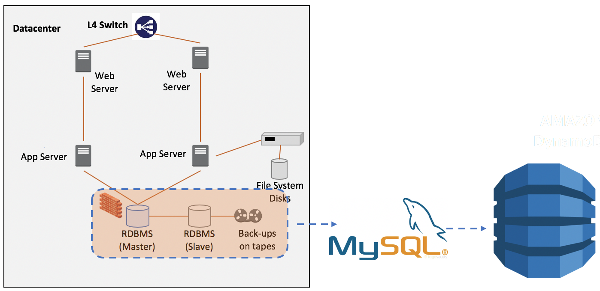
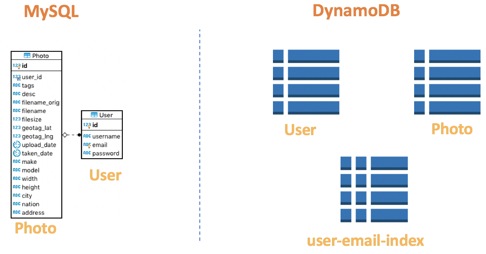
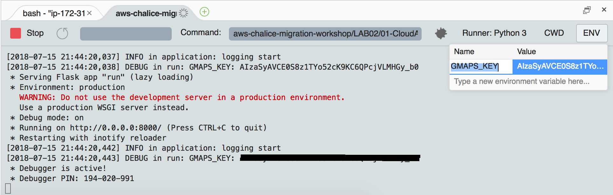
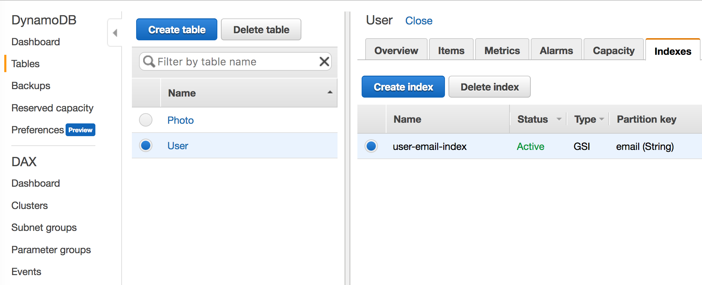
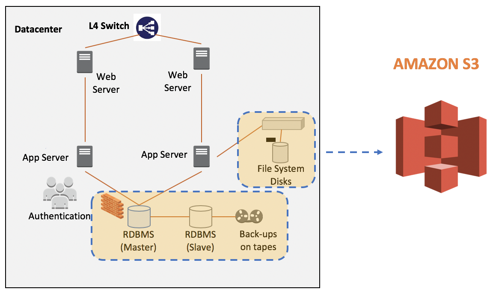

# LAB 02 - Move to serverless
We will move the components of legacy application which has constraints of scalability and high availability to serverless environment one by one.

## TASK 1. Go to DynamoDB
Amazon [DynamoDB](https://aws.amazon.com/dynamodb/) is a nonrelational database that delivers reliable performance at any scale. It's a fully managed, multi-region, multi-master database that provides consistent single-digit millisecond latency, and offers built-in security, backup and restore, and in-memory caching.

In this TASK, we will introduce DynamoDB for CloudAlbum application. We also introduce pynamodb which is a Pythonic interface to Amazon’s DynamoDB. By using simple, yet powerful abstractions over the DynamoDB API. It is similar to SQLAlchemy.


* Leagacy application uses RDBMS(MySQL), we will replace it to DynamoDB. DynamoDB is fully managed service.It means that automatically scales throughput up or down, and continuously backs up your data for protection.


* Legacy application uses **SQLAlchemy** for OR-Mapping. SQLAlchemy is the Python SQL toolkit and Object Relational Mapper that gives application developers the full power and flexibility of SQL.
  * visit : https://www.sqlalchemy.org/

* We will use **PynamoDB** instead of **SQLAlchemy** for OR-Mapping of DynamoDB. It is similar with SQLAlchemy. PynamoDB is a Pythonic interface to Amazon’s DynamoDB. By using simple, yet powerful abstractions over the DynamoDB API, PynamoDB allows you to start developing immediately.
  * visit : https://github.com/pynamodb/PynamoDB

* Legacy application has simple data model and we can design DynamoDB table easily.
  

1. Open the **models.py** which located in  'LAB02/01-CloudAlbum-DDB/cloudalbum/model/models.py'.

2. Review the data model definition via **SQLAlchemy**.
```python
from sqlalchemy import Float, DateTime, ForeignKey, Integer, String
from flask_login import UserMixin
from flask_sqlalchemy import SQLAlchemy
from cloudalbum import login

db = SQLAlchemy()


class User(UserMixin, db.Model):
    """
    Database Model class for User table
    """
    __tablename__ = 'User'

    id = db.Column(Integer, primary_key=True)
    username = db.Column(String(50), unique=False)
    email = db.Column(String(50), unique=True)
    password = db.Column(String(100), unique=False)

    photos = db.relationship('Photo',
                             backref='user',
                             cascade='all, delete, delete-orphan')

    def __init__(self, name, email, password):
        self.username = name
        self.email = email
        self.password = password

    def __repr__(self):
        return '<%r %r %r>' % (self.__tablename__, self.username, self.email)


class Photo(db.Model):
    """
    Database Model class for Photo table
    """
    __tablename__ = 'Photo'

    id = db.Column(Integer, primary_key=True)
    user_id = db.Column(Integer, ForeignKey(User.id))
    tags = db.Column(String(400), unique=False)
    desc = db.Column(String(400), unique=False)
    filename_orig = db.Column(String(400), unique=False)
    filename = db.Column(String(400), unique=False)
    filesize = db.Column(Integer, unique=False)
    geotag_lat = db.Column(Float, unique=False)
    geotag_lng = db.Column(Float, unique=False)
    upload_date = db.Column(DateTime, unique=False)
    taken_date = db.Column(DateTime, unique=False)
    make = db.Column(String(400), unique=False)
    model = db.Column(String(400), unique=False)
    width = db.Column(String(400), unique=False)
    height = db.Column(String(400), unique=False)
    city = db.Column(String(400), unique=False)
    nation = db.Column(String(400), unique=False)
    address = db.Column(String(400), unique=False)

    def __init__(self, user_id, tags, desc, filename_orig, filename, filesize, geotag_lat, geotag_lng, upload_date,
                 taken_date, make, model, width, height, city, nation, address):
        """Initialize"""

        self.user_id = user_id
        self.tags = tags
        self.desc = desc
        self.filename_orig = filename_orig
        self.filename = filename
        self.filesize = filesize
        self.geotag_lat = geotag_lat
        self.geotag_lng = geotag_lng
        self.upload_date = upload_date
        self.taken_date = taken_date
        self.make = make
        self.model = model
        self.width = width
        self.height = height
        self.city = city
        self.nation = nation
        self.address = address

    def __repr__(self):
        """print information"""

        return '<%r %r %r>' % (self.__tablename__, self.user_id, self.upload_date)
```

3. Open the **models_ddb.py** which located in  'LAB02/01-CloudAlbum-DDB/cloudalbum/model/models_ddb.py'.


4. Review the data model definition via **PynamoDB**.
```python
from pynamodb.models import Model
from pynamodb.attributes import UnicodeAttribute, NumberAttribute, UTCDateTimeAttribute
from flask_login import UserMixin
from pynamodb.indexes import GlobalSecondaryIndex, IncludeProjection
from cloudalbum import login
from cloudalbum import util
from cloudalbum.config import conf


class EmailIndex(GlobalSecondaryIndex):
    """
    This class represents a global secondary index
    """

    class Meta:
        index_name = 'user-email-index'
        read_capacity_units = 2
        write_capacity_units = 1
        projection = IncludeProjection(['password'])

    # This attribute is the hash key for the index
    # Note that this attribute must also exist
    # in the model
    email = UnicodeAttribute(hash_key=True)


class User(Model, UserMixin):
    """
    User table for DynamoDB
    """

    class Meta:
        table_name = 'User'
        region = conf['AWS_REGION']

    id = UnicodeAttribute(hash_key=True)
    email_index = EmailIndex()
    email = UnicodeAttribute(null=False)
    username = UnicodeAttribute(null=False)
    password = UnicodeAttribute(null=False)


class Photo(Model):
    """
    User table for DynamoDB
    """

    class Meta:
        table_name = 'Photo'
        region = conf['AWS_REGION']

    user_id = UnicodeAttribute(hash_key=True)
    id = NumberAttribute(range_key=True)
    tags = UnicodeAttribute(null=False)
    desc = UnicodeAttribute(null=False)
    filename_orig = UnicodeAttribute(null=False)
    filename = UnicodeAttribute(null=False)
    filesize = NumberAttribute(null=False)
    geotag_lat = UnicodeAttribute(null=False)
    geotag_lng = UnicodeAttribute(null=False)
    upload_date = UTCDateTimeAttribute(default=util.the_time_now())
    taken_date = UTCDateTimeAttribute(default=util.the_time_now())
    make = UnicodeAttribute(null=True)
    model = UnicodeAttribute(null=True)
    width = UnicodeAttribute(null=False)
    height = UnicodeAttribute(null=False)
    city = UnicodeAttribute(null=True)
    nation = UnicodeAttribute(null=False)
    address = UnicodeAttribute(null=False)
```

5. Review the '__init__.py' in the model package. The DynamoDB table 'User' and 'Photo' will be created automatically for the convenience. 

```python
from cloudalbum.config import conf
from cloudalbum.model.models_ddb import User
from cloudalbum.model.models_ddb import Photo

if not User.exists():
    User.create_table(read_capacity_units=conf['DDB_RCU'], write_capacity_units=conf['DDB_WCU'], wait=True)
    print('DynamoDB User table created!')

if not Photo.exists():
    Photo.create_table(read_capacity_units=conf['DDB_RCU'], write_capacity_units=conf['DDB_WCU'], wait=True)
    print('DynamoDB Photo table created!')
```

6. Review the 'LAB02/01-CloudAlbum-DDB/cloudalbum/config.py' file. Additional attributes are added for DynamoDB.
```python
import os

conf = {
   
    ( ... )
    
    # DynamoDB
    'AWS_REGION': os.getenv('AWS_REGION', 'ap-southeast-1'),
    'DDB_RCU': os.getenv('DDB_RCU', 10),
    'DDB_WCU': os.getenv('DDB_WCU', 10),

}
```
* The second parameter of **os.getenv** function is the default value to use when the first parameter does not exist.

7. Write your code for user signup.
* find **TODO #1** in the 'LAB02/01-CloudAlbum-DDB/cloudalbum/controlloer/user/userView.py' file.
```python
if not user_exist:
    ## TODO #1 : Write your code to save user information
```
* solution:

```python
user = User(uuid.uuid4().hex)
user.email = form.email.data
user.password = generate_password_hash(form.password.data)
user.username = form.username.data
user.save()
```

**NOTE**: The partition key value of User table used **uuid.uuid4().hex** for the appropriate key distribution.

8. Write your code to search result via keyword in the DynamoDB.
* find **TODO #2** in the 'LAB02/01-CloudAlbum-DDB/cloudalbum/controlloer/photo/photoView.py' file.
```python
## TODO #2 : Write your code to search result via keyword in the DynamoDB.
```

* solution:
```python
keyword = request.form['search']
photo_pages = Photo.query(current_user.id, Photo.tags.contains(keyword) | Photo.desc.contains(keyword))
```

9. Write your code to update user profile to DynamoDB.
* find **TODO #3** in the 'LAB02/01-CloudAlbum-DDB/cloudalbum/controlloer/user/userView.py' file.
```python
## TODO #3 : Write your code to update user profile to DynamoDB.
```

* solution:
```python
user = User.get(user_id)
user.update(actions=[
    User.username.set(data['username']),
    User.password.set(generate_password_hash(data['password']))
])
```

10. Write your code to delete uploaded photo information in DynamoDB.
* find **TODO #4** in the 'LAB02/01-CloudAlbum-DDB/cloudalbum/controlloer/photo/photoView.py' file.
```python
## TODO #4 : Write your code to delete uploaded photo information in DynamoDB.
```

* solution : 
```python
photo = Photo.get(current_user.id, photo_id)
photo.delete()
```


11. Run CloudAlbum application with DynamoDB.
* Ensure **Runner: Python 3**



12. Connect to http://localhost:8000 in your browser. (After SSH tunnel established.)


13. Perform application test.


* Sign in / up
* Upload Sample Photos
* Sample images download here 
  *  https://d2r3btx883i63b.cloudfront.net/temp/sample-photo.zip
* Look your Album
* Change Profile
* Find photos with Search tool
* Check the Photo Map

14. Then look into AWS DynamoDB console.
* User and Photo tables are auto generated with 'user-email-index'
* Review saved data of each DynamoDB tables.



Is it OK? Let's move to the next TASK.

## TASK 2. Go to S3
CloudAlbum stored user uploaded images into disk based storage. (EBS or NAS). However these storage is not scalable enough. 

[Amazon S3](https://aws.amazon.com/s3/) has a simple web services interface that you can use to store and retrieve any amount of data, at any time, from anywhere on the web. It gives any developer access to the same highly scalable, reliable, fast, inexpensive data storage infrastructure that Amazon uses to run its own global network of web sites. The service aims to maximize benefits of scale and to pass those benefits on to developers.



* We will use Boto3 - S3 API to handle uploaded photo image object from the user.
   * visit: https://boto3.readthedocs.io/en/latest/reference/services/s3.html 

* We will retrieve image object with pre-signed URL for authorized user.

15. Make a bucket to save photo image objects and retriev it from Amazon S3. 


## TASK 3. Go to Cognito


## TASK 4. Go to X-ray

