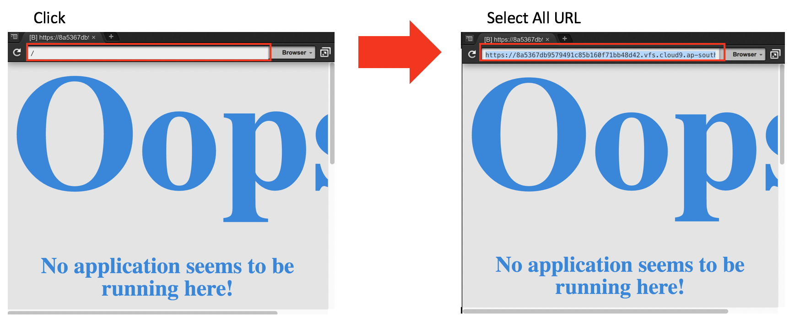
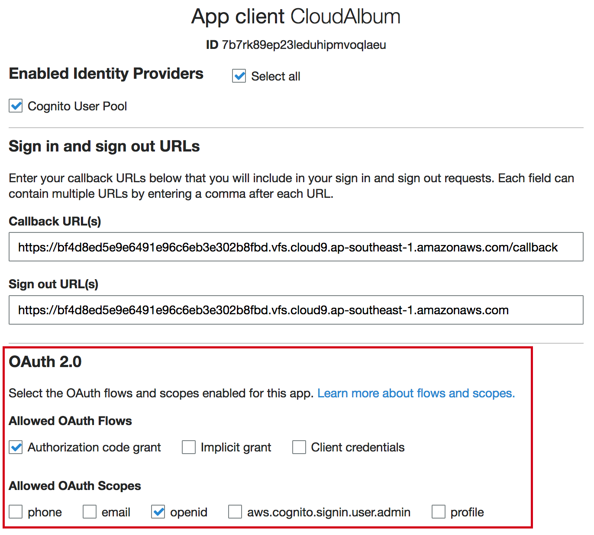
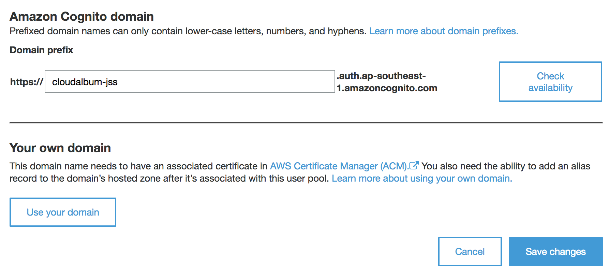
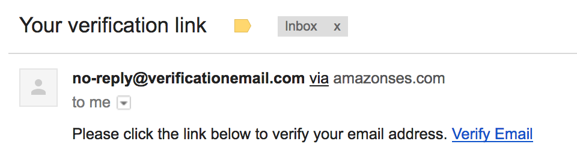
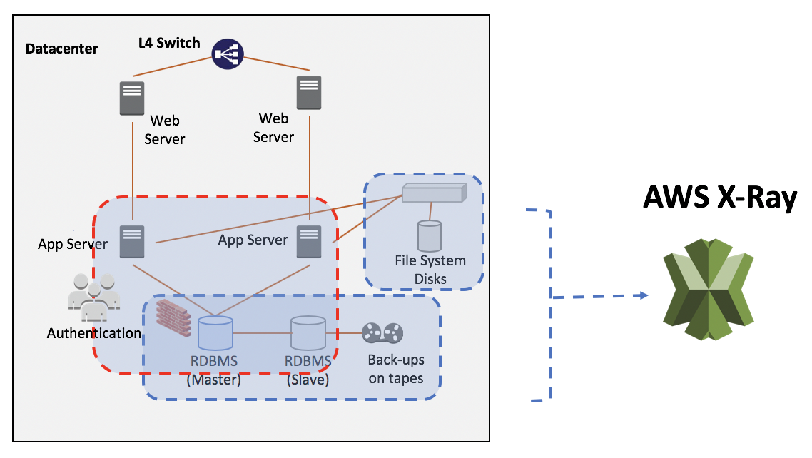

# LAB 02 - Move to serverless
We will move the components of legacy application which has constraints of scalability and high availability to serverless environment one by one.

## TASK 0. Permission grant for Cloud9

AWS Cloud9 is configured with **AWS managed temporary credentials** as default. However we will **not use** AWS managed temporary credentials due to our application need various service such as DynamoDB, S3, Lambda and so on. We will use our own policy for this workshop.

There are two ways. One is to use [1] **Using Instance Profile** with temporary credentials and this is recommended. The other way is **Store Permanent Access Credentials** in the credential file which related administrator privileadge already you used. (You can also use environment variables as a alternative way)

* Related document : [Create and Use an Instance Profile to Manage Temporary Credentials](https://docs.aws.amazon.com/cloud9/latest/user-guide/credentials.html)

* **Choose following one** :
  * `[1] Using Instance Profile` or
  * `[2] Store Permanent Access Credentials`

* `[1] Using Instance Profile` is recommended. However If you want **quick start**, you can choose `[2] Store Permanent Access Credentials` with enough permission.

### [1] Using Instance Profile

### [1-1] Check the AWS credentials in Cloud9 instance.
* Run following command, then you can see the AWS managed temporary credentials.
``` console
aws configure list
```
* output
``` 
lachesis:~/environment $ aws configure list
      Name                    Value             Type    Location
      ----                    -----             ----    --------
   profile                <not set>             None    None
access_key     ****************YV3J shared-credentials-file    
secret_key     ****************F240 shared-credentials-file    
    region           ap-southeast-1      config-file    ~/.aws/config
```

### [1-2] Disable AWS managed temporary credentials


* (1) Click the setup(gear) icon
* (2) Select `AWS SETTINGS`.
* (3) Disable `AWS managed temporary credentials`

* Check the AWS credentials in Cloud9 instance.
```console
aws configure list
```
* output:
```
      Name                    Value             Type    Location
      ----                    -----             ----    --------
   profile                <not set>             None    None
access_key                <not set>             None    None
secret_key                <not set>             None    None
    region                <not set>             None    None
```

* OK, done. Move to next step.


#### [1-3] Create an Instance Profile with the AWS CLI ###

### Working on your LOCAL MACHINE terminal or your EC2

**NOTE:** Before you run below command, **make sure you have enough privileges.** (such as `AdministratorAccess` policy).

* You may have `AdministratorAccess` privileged **AWS CLI environment** such as your LOCAL MACHINE or your EC2.

  * Download `generate_instance_profile.sh`.

```console
wget https://raw.githubusercontent.com/liks79/aws-chalice-migration-workshop/master/resources/generate_instance_profile.sh
```
* If you want, **review** the `generate_instance_profile.sh` file.
```console
wget https://raw.githubusercontent.com/liks79/aws-chalice-migration-workshop/master/resources/workshop-cloud9-instance-profile-role-trust.json
wget https://raw.githubusercontent.com/liks79/aws-chalice-migration-workshop/master/resources/workshop-cloud9-policy.json

PARN=$(aws iam create-policy --policy-name workshop-cloud9-policy --policy-document file://workshop-cloud9-policy.json --query "Policy.Arn" --output text)
aws iam create-role --role-name workshop-cloud9-instance-profile-role --assume-role-policy-document file://workshop-cloud9-instance-profile-role-trust.json
aws iam attach-role-policy --role-name workshop-cloud9-instance-profile-role --policy-arn $PARN
aws iam create-instance-profile --instance-profile-name workshop-cloud9-instance-profile
aws iam add-role-to-instance-profile --role-name workshop-cloud9-instance-profile-role --instance-profile-name workshop-cloud9-instance-profile
```

 * Add `execute` permission
```console
chmod +x generate_instance_profile.sh
```

 * **Run** script with enough privileges, such as `AdministratorAccess` policy. (**Currently, you can not run this command in Cloud9 terminal.**):
```console
./generate_instance_profile.sh
```

* If you want, **review** the `workshop-cloud9-policy.json` policy.
```json
{
    "Version": "2012-10-17",
    "Statement": [
        {
            "Sid": "VisualEditor0",
            "Effect": "Allow",
            "Action": [
                "apigateway:*",
                "s3:*",
                "ec2:*",
                "cloudwatch:*",
                "iam:*",
                "ssm:*",
                "lambda:*",
                "cloud9:*",
                "dynamodb:*",
                "xray:*"
            ],
            "Resource": "*",
                "Condition": {
                    "DateLessThan": {"aws:CurrentTime": "2018-08-31T23:59:59Z"}
                }
        }
    ]

}

```


#### [1-4] Attach an Instance Profile to Cloud9 Instance with the AWS CLI

* Get instance-id of Cloud9 environment, For this we need **Cloud9 environment name**. We defined it LAB 01. (**workshop-\<INITIAL\>**). 

* Attach an **Instance Profile** which made previous step to Cloud9 Instance.

* Replace **workshop-\<INITIAL\>** to real value.
```console
INSTANCE_ID=$(aws ec2 describe-instances --query "Reservations[*].Instances[*].InstanceId" --filter "Name=tag:Name, Values=aws-cloud9-workshop-<INITIAL>*" --region ap-southeast-1 --output=text)

echo $INSTANCE_ID

aws ec2 associate-iam-instance-profile --iam-instance-profile  Name=workshop-cloud9-instance-profile --region ap-southeast-1 --instance-id $INSTANCE_ID
```
* Run the following command to check the result: 

```console
aws ec2 describe-instances --query "Reservations[].Instances[].IamInstanceProfile" --instance-id $INSTANCE_ID --region ap-southeast-1
```
* output: 
```
[
    {
        "Arn": "arn:aws:iam::123456789012:instance-profile/workshop-cloud9-instance-profile",
        "Id": "AIPAIFQCLU7KO6ML343DDD"
    }
]
```
* Now `workshop-cloud9-instance-profile` is attached our Cloud9 instance.


### Back to the your Cloud9 terminal.

 * Configure default region:
```console
aws configure set region ap-southeast-1
```
 * Check the configured credentials
```console
aws configure list
```
* output:
```
      Name                    Value             Type    Location
      ----                    -----             ----    --------
   profile                <not set>             None    None
access_key     ****************LZOJ         iam-role    
secret_key     ****************hK+3         iam-role    
    region           ap-southeast-1      config-file    ~/.aws/config
```

* You can see the `iam-role` type of access_key and secret_key. Well done.

* Is it OK? 
  * **Go to TASK 1**

### [2] Store Permanent Access Credentials ###
**NOTE:** This is **an ALTERNATIVE WAY** of `[1] Using Instance Profile`. If you complete `[1] Using Instance Profile`, You can pass below steps and **go to TASK 1.**

* **NOTE:** Before you proceed, please complet following steps:
  * [1-1] Check the AWS credentials in Cloud9 instance.
  * [1-2] You must disable AWS managed temporary credentials


* Configure your own credentials:
```console
aws configure set aws_access_key_id <YOUR OWN ACCESS KEY ID>
aws configure set aws_secret_access_key <YOUR OWN ACCESS KEY ID>
aws configure set region ap-southeast-1
```

* OK, all things are done. Go to TASK 1.

* **ALTERNATIVE**: You can configure following variables before run application or CLI commands. `AdministratorAccess` privilege is recommended. (refer to above `workshop-cloud9-policy.json`.)
`export AWS_ACCESS_KEY_ID=<YOUR OWN ACCESS KEY ID>` and `export AWS_SECRET_ACCESS_KEY=<YOUR OWN ACCESS KEY ID>`


## TASK 1. Go to DynamoDB
Amazon [DynamoDB](https://aws.amazon.com/dynamodb/) is a nonrelational database that delivers reliable performance at any scale. It's a fully managed, multi-region, multi-master database that provides consistent single-digit millisecond latency, and offers built-in security, backup and restore, and in-memory caching.

In this TASK, we will introduce DynamoDB for CloudAlbum application. We also introduce pynamodb which is a Pythonic interface to Amazon’s DynamoDB. By using simple, yet powerful abstractions over the DynamoDB API. It is similar to SQLAlchemy.


* Leagacy application uses RDBMS(MySQL), we will replace it to DynamoDB. DynamoDB is fully managed service.It means that automatically scales throughput up or down, and continuously backs up your data for protection.


* Legacy application uses **SQLAlchemy** for OR-Mapping. SQLAlchemy is the Python SQL toolkit and Object Relational Mapper that gives application developers the full power and flexibility of SQL.
  * visit : https://www.sqlalchemy.org/

* We will use **PynamoDB** instead of **SQLAlchemy** for OR-Mapping of DynamoDB. It is similar with SQLAlchemy. PynamoDB is a Pythonic interface to Amazon’s DynamoDB. By using simple, yet powerful abstractions over the DynamoDB API, PynamoDB allows you to start developing immediately.
  * visit : https://github.com/pynamodb/PynamoDB

* Legacy application has simple data model and we can design DynamoDB table easily.
  

1. Install required Python packaged:
```console
sudo pip-3.6 install -r ~/environment/aws-chalice-migration-workshop/LAB02/01-CloudAlbum-DDB/requirements.txt
```


2. Open the **models.py** which located in  '**LAB02/01-CloudAlbum-DDB**/cloudalbum/model/models.py'.

3. Review the data model definition via **SQLAlchemy**. `User` tables and `Photo` tables are inherited from SQLAlchemy's **db.Model** and are represented in **Python classes**.
```python
from sqlalchemy import Float, DateTime, ForeignKey, Integer, String
from flask_login import UserMixin
from flask_sqlalchemy import SQLAlchemy
from cloudalbum import login

db = SQLAlchemy()


class User(UserMixin, db.Model):
    """
    Database Model class for User table
    """
    __tablename__ = 'User'

    id = db.Column(Integer, primary_key=True)
    username = db.Column(String(50), unique=False)
    email = db.Column(String(50), unique=True)
    password = db.Column(String(100), unique=False)

    photos = db.relationship('Photo',
                             backref='user',
                             cascade='all, delete, delete-orphan')

    def __init__(self, name, email, password):
        self.username = name
        self.email = email
        self.password = password

    def __repr__(self):
        return '<%r %r %r>' % (self.__tablename__, self.username, self.email)


class Photo(db.Model):
    """
    Database Model class for Photo table
    """
    __tablename__ = 'Photo'

    id = db.Column(Integer, primary_key=True)
    user_id = db.Column(Integer, ForeignKey(User.id))
    tags = db.Column(String(400), unique=False)
    desc = db.Column(String(400), unique=False)
    filename_orig = db.Column(String(400), unique=False)
    filename = db.Column(String(400), unique=False)
    filesize = db.Column(Integer, unique=False)
    geotag_lat = db.Column(Float, unique=False)
    geotag_lng = db.Column(Float, unique=False)
    upload_date = db.Column(DateTime, unique=False)
    taken_date = db.Column(DateTime, unique=False)
    make = db.Column(String(400), unique=False)
    model = db.Column(String(400), unique=False)
    width = db.Column(String(400), unique=False)
    height = db.Column(String(400), unique=False)
    city = db.Column(String(400), unique=False)
    nation = db.Column(String(400), unique=False)
    address = db.Column(String(400), unique=False)

    def __init__(self, user_id, tags, desc, filename_orig, filename, filesize, geotag_lat, geotag_lng, upload_date,
                 taken_date, make, model, width, height, city, nation, address):
        """Initialize"""

        self.user_id = user_id
        self.tags = tags
        self.desc = desc
        self.filename_orig = filename_orig
        self.filename = filename
        self.filesize = filesize
        self.geotag_lat = geotag_lat
        self.geotag_lng = geotag_lng
        self.upload_date = upload_date
        self.taken_date = taken_date
        self.make = make
        self.model = model
        self.width = width
        self.height = height
        self.city = city
        self.nation = nation
        self.address = address

    def __repr__(self):
        """print information"""

        return '<%r %r %r>' % (self.__tablename__, self.user_id, self.upload_date)
```

4. Open the **models_ddb.py** which located in  'LAB02/01-CloudAlbum-DDB/cloudalbum/model/models_ddb.py'.


5. Review the data model definition via **PynamoDB**. This will show how DynamoDB tables and GSI are defined in PynamoDB. They are all expressed in **Python Class.**

```python
from pynamodb.models import Model
from pynamodb.attributes import UnicodeAttribute, NumberAttribute, UTCDateTimeAttribute
from flask_login import UserMixin
from pynamodb.indexes import GlobalSecondaryIndex, IncludeProjection
from cloudalbum import login
from cloudalbum import util
from cloudalbum.config import conf


class EmailIndex(GlobalSecondaryIndex):
    """
    This class represents a global secondary index
    """

    class Meta:
        index_name = 'user-email-index'
        read_capacity_units = 2
        write_capacity_units = 1
        projection = IncludeProjection(['password'])

    # This attribute is the hash key for the index
    # Note that this attribute must also exist
    # in the model
    email = UnicodeAttribute(hash_key=True)


class User(Model, UserMixin):
    """
    User table for DynamoDB
    """

    class Meta:
        table_name = 'User'
        region = conf['AWS_REGION']

    id = UnicodeAttribute(hash_key=True)
    email_index = EmailIndex()
    email = UnicodeAttribute(null=False)
    username = UnicodeAttribute(null=False)
    password = UnicodeAttribute(null=False)


class Photo(Model):
    """
    User table for DynamoDB
    """

    class Meta:
        table_name = 'Photo'
        region = conf['AWS_REGION']

    user_id = UnicodeAttribute(hash_key=True)
    id = NumberAttribute(range_key=True)
    tags = UnicodeAttribute(null=False)
    desc = UnicodeAttribute(null=False)
    filename_orig = UnicodeAttribute(null=False)
    filename = UnicodeAttribute(null=False)
    filesize = NumberAttribute(null=False)
    geotag_lat = UnicodeAttribute(null=False)
    geotag_lng = UnicodeAttribute(null=False)
    upload_date = UTCDateTimeAttribute(default=util.the_time_now())
    taken_date = UTCDateTimeAttribute(default=util.the_time_now())
    make = UnicodeAttribute(null=True)
    model = UnicodeAttribute(null=True)
    width = UnicodeAttribute(null=False)
    height = UnicodeAttribute(null=False)
    city = UnicodeAttribute(null=True)
    nation = UnicodeAttribute(null=False)
    address = UnicodeAttribute(null=False)
```

6. Review the `__init__.py` in the model package. The DynamoDB **User** and **Photo** **tables will be created automatically** for the convenience. **Note** the `create_table` function.

```python
from cloudalbum.config import conf
from cloudalbum.model.models_ddb import User
from cloudalbum.model.models_ddb import Photo

if not User.exists():
    User.create_table(read_capacity_units=conf['DDB_RCU'], write_capacity_units=conf['DDB_WCU'], wait=True)
    print('DynamoDB User table created!')

if not Photo.exists():
    Photo.create_table(read_capacity_units=conf['DDB_RCU'], write_capacity_units=conf['DDB_WCU'], wait=True)
    print('DynamoDB Photo table created!')
```

7. Review the 'LAB02/01-CloudAlbum-DDB/cloudalbum/config.py' file. **New attributes** are added for DynamoDB.

 * Set up `GMAPS_KEY` value : Replace `<REAL_GMAPS_KEY_PROVIDED_BY_INSTRUCTOR>` to real value which used previous hands-on lab.

```python
import os

conf = {

    # Mandatory variable
    'GMAPS_KEY': os.getenv('GMAPS_KEY', '<REAL_GMAPS_KEY_PROVIDED_BY_INSTRUCTOR>'),

    ( ... )

    # DynamoDB
    'AWS_REGION': os.getenv('AWS_REGION', 'ap-southeast-1'),
    'DDB_RCU': os.getenv('DDB_RCU', 10),
    'DDB_WCU': os.getenv('DDB_WCU', 10),

}
```
* The second parameter of **os.getenv** function is the default value to use when the first parameter does not exist.

8. Review following code for user signup.
* Find **TODO #1** in the 'LAB02/01-CloudAlbum-DDB/cloudalbum/controlloer/user/userView.py' file.
```python
    if not user_exist:
        ## TODO #1 : Review following code to save user information
        ## -- begin --
        user = User(uuid.uuid4().hex)
        user.email = form.email.data
        user.password = generate_password_hash(form.password.data)
        user.username = form.username.data
        user.save()
        ## -- end --
```

**NOTE**: The partition key value of User table used **uuid.uuid4().hex** for the appropriate key distribution.

9. Review following code to update user profile to DynamoDB.
* Find **TODO #2** in the 'LAB02/01-CloudAlbum-DDB/cloudalbum/controlloer/user/userView.py' file.
```python
    ## TODO #2 : Review following code to update user profile to DynamoDB.
    ## -- begin --
    user = User.get(user_id)
    user.update(actions=[
        User.username.set(data['username']),
        User.password.set(generate_password_hash(data['password']))
    ])
    ## --end --
```
* Above code shows the way of `update` DynamoDB table via PynamoDB query mapper.


10. Review following code to search result via keyword in the DynamoDB.
* find **TODO #3** in the 'LAB02/01-CloudAlbum-DDB/cloudalbum/controlloer/photo/photoView.py' file.
```python
    ## TODO #3 : Review following code to search result via keyword in the DynamoDB.
    ## -- begin --
    keyword = request.form['search']
    photo_pages = Photo.query(current_user.id,
                                Photo.tags.contains(keyword) |
                                Photo.desc.contains(keyword))
    ## -- end --
```
* Above code shows how to use query filter via PynamoDB.


11. Review following code to delete uploaded photo information in DynamoDB.
* Find **TODO #4** in the 'LAB02/01-CloudAlbum-DDB/cloudalbum/controlloer/photo/photoView.py' file.
```python
    ## TODO #4 : Review following code to delete uploaded photo information in DynamoDB.
    ## -- begin --
    photo = Photo.get(current_user.id, photo_id)
    photo.delete()
    ## -- end --
```

12. Open the `run.py` and run CloudAlbum application with DynamoDB. (`LAB02/01-CloudAlbum-DDB/cloudalbum/run.py`)

* **NOTE:** **GMAPS_KEY** variable is must defined before you run.

* Ensure **Runner: Python 3**


13. Connect to your application using **Cloud9 preview** or http://localhost:8080 in your browser. (After SSH tunnel established.)


* You need to **Sign-up** first.

14. Perform application test.


* Sign in / up
* Upload Sample Photos
* Sample images download here
  *  https://d2r3btx883i63b.cloudfront.net/temp/sample-photo.zip
* Look your Album
* Change Profile
* Find photos with Search tool
* Check the Photo Map

15. Then look into AWS DynamoDB console.
* User and Photo tables are auto generated with 'user-email-index'
* Review saved data of each DynamoDB tables.


Is it OK? Let's move to the next TASK.

**NOTE:** Click the `stop icon` to stop your application.
  * **Close your terminal** after application stop.
  * **Close all your opened file tab.**


16. Delete data in the application for the next TASK.
* File system will be changed from **local disk** to **Amazon S3**.
* So, if you don't delete your album article which submitted this task, then **you will see your album article without images** when you run the application on the next TASK,


## TASK 2. Go to S3
CloudAlbum stored user uploaded images into disk based storage. (EBS or NAS). However these storage is not scalable enough.

[Amazon S3](https://aws.amazon.com/s3/) has a simple web services interface that you can use to store and retrieve any amount of data, at any time, from anywhere on the web. It gives any developer access to the same highly scalable, reliable, fast, inexpensive data storage infrastructure that Amazon uses to run its own global network of web sites. The service aims to maximize benefits of scale and to pass those benefits on to developers.


* We will use Boto3 - S3 API to handle uploaded photo image object from the user.
   * visit: https://boto3.readthedocs.io/en/latest/reference/services/s3.html

* We will retrieve image object with pre-signed URL for authorized user.

17. Make a bucket to save photo image objects and retriev it from Amazon S3.

```
aws s3 mb s3://cloudalbum-<INITIAL>
```

18. Review the config.py file which located in 'LAB02/02-CloudAlbum-S3/cloudalbum/config.py'

* Set up `GMAPS_KEY` value : Replace `<REAL_GMAPS_KEY_PROVIDED_BY_INSTRUCTOR>` to **real API key** which used previous hands-on lab.

* Set up the value of 'S3_PHOTO_BUCKET'. Please change the `cloudalbum-<INITIAL>` to your **real bucket name** which made above.

```python
import os

conf = {

    # Mandatory variable
    'GMAPS_KEY': os.getenv('GMAPS_KEY', '<REAL_GMAPS_KEY_PROVIDED_BY_INSTRUCTOR>'),
    
    (....)

    # DynamoDB
    'AWS_REGION': os.getenv('AWS_REGION', 'ap-southeast-1'),
    'DDB_RCU': os.getenv('DDB_RCU', 10),
    'DDB_WCU': os.getenv('DDB_WCU', 10),

    # S3
    'S3_PHOTO_BUCKET': os.getenv('S3_PHOTO_BUCKET', 'cloudalbum-<INITIAL>')
}
```


19. Review following code to save thumbnail image object to S3.
* Find **TODO #5** in the 'LAB02/02-CloudAlbum-S3/cloudalbum/util.py' file.
```python
    ## TODO #5 : Review following code to save thumbnail image object to S3
    ## -- begin --
    upload_file_stream.stream.seek(0)

    s3_client.put_object(
        Bucket=conf['S3_PHOTO_BUCKET'],
        Key=key_thumb,
        Body=make_thumbnails_s3(upload_file_stream, app),
        ContentType='image/jpeg',
        StorageClass='STANDARD'
    )
    ## -- end --
```
**NOTE**: To reuse file stream, we need to call **seek(0)**.
```
upload_file_stream.stream.seek(0)
```

20. Review your code to retrieve pre-signed URL from S3.
* Find **TODO #6** in the 'LAB02/02-CloudAlbum-S3/cloudalbum/util.py' file.
```python
    ## TODO #6 : Review following code to retrieve pre-signed URL from S3.
    ## -- begin --
    if Thumbnail:
        key_thumb = "{0}{1}".format(prefix_thumb, filename)
        url = s3_client.generate_presigned_url(
            'get_object',
            Params={'Bucket': conf['S3_PHOTO_BUCKET'],
                    'Key': key_thumb})
    else:
        key = "{0}{1}".format(prefix, filename)
        url = s3_client.generate_presigned_url(
            'get_object',
            Params={'Bucket': conf['S3_PHOTO_BUCKET'],
                    'Key': key})
    ## -- end --
```
* Default expire time is 1 hour (3600 sec). Function description is below.
  * Related document : https://boto3.readthedocs.io/en/latest/reference/services/s3.html 
```python
generate_presigned_url(ClientMethod, Params=None, ExpiresIn=3600, HttpMethod=None)

    Generate a presigned url given a client, its method, and arguments

    Parameters

            ClientMethod (string) -- The client method to presign for
            Params (dict) -- The parameters normally passed to ClientMethod.
            ExpiresIn (int) -- The number of seconds the presigned url is valid for. By default it expires in an hour (3600 seconds)
            HttpMethod (string) -- The http method to use on the generated url. By default, the http method is whatever is used in the method's model.

    Returns

        The presigned url
```


21. Open the `run.py` and run the application with DynamoDB and S3.

* Ensure **Runner: Python 3**


22. Connect to your application using **Cloud9 preview** or http://localhost:8080 in your browser. (After SSH tunnel established.)

23. Perform application test.


* Sign in / up
* Upload Sample Photos
* Sample images download here
  *  https://d2r3btx883i63b.cloudfront.net/temp/sample-photo.zip
* Look your Album
* Change Profile
* Find photos with Search tool
* Check the Photo Map

24. Examine DynamoDB Console and S3 Console.


* You can find your uploaded image objects with thumbnails.

Is it OK? Let's move to the next TASK.

**NOTE:** Click the `stop icon` to stop your application.
  * **Close your terminal** after application stop.
  * **Close all your opened file tab.**


## TASK 3. Go to Cognito
In this TASK, you will add a sign-up/sign-in component to CloudAlbum application by using Amazon Cognito. After setting up Amazon Cognito, user information will retrieved from the Amazon Cognito.


To begin, follow the steps below.

**Set up an Amazon Cognito user pool.**

25. In the AWS Console, go to the **Amazon Cognito**

26. Make sure you are still in the **Singapore(ap-southeast-1)** region.

27. Click **Manage your User Pools**.

28. At the top right corner, click **Create a user pool**.

29. For **Pool name**, type **cloudalbum-pool-\<INITIAL\>**.

30. Click **Step through settings**.

31. For **How do you want your end users to sign in?**, select **Email address or phone number**.


32. For **Which standard attributes do you want to require?**, select **name**.

33. Click **Next step**.

34. Leave the default settings on the Policy page and click **Next step**.

35. Skip the MFA and verifications pages and click **Next step**.

36. On the **Message customization** page, select **Verification Type** as **Link**. Feel free to customize the email body.

37. Click **Next Step**.

38. Skip the Tag section and click **Next Step**.

39. Leave the default setting on the **Devices** page and click **Next step**.

40. On the **App Clients** page, click **Add an app client**.

41. For **App client name,** type a client name, for example, **CloudAlbum**.

42. Leave the other default settings and click **Create app client**.

43. Click **Next Step**.

44. Skip the **Triggers** page and click **Next Step**

45. On the **Review** page, click **Create Pool**.

46. After the pool is created, write down the **Pool ID** for later use.

47. In the left navigation menu, under **App integration**, click **App client settings**.

48. For **Enabled Identity Providers**, check **Cognito User Pool**.
* Check the Cloud9 ResourceId. 
```console 
RESOURCE_ID=$(aws ec2 describe-tags --query "Tags[].Value" --filters "Name=resource-id, Values=`ec2-metadata --instance-id | cut -f2 -d ' '`" "Name=key, Values=aws:cloud9:environment" --output text)

echo "https://$RESOURCE_ID.vfs.cloud9.ap-southeast-1.amazonaws.com"

```
* **\<YOUR PREVIEW URL\>** is :  
```
https://<CLOUD9_RESOURCE_ID>.vfs.cloud9.ap-southeast-1.amazonaws.com
```
* **KEEP THIS VALUE FOR LATER USE**

 * For **Cloud9 Preview** user:
   * For **Callback URL(s)** type `https://<YOUR PREVIEW URL>/callback`
   * For **Sign out URL(s)** type `https://<YOUR PREVIEW URL>`
   * **NOTE:** This is an **alternative way** of check ResourceId. If you complete checking <YOUR PREVIEW URL>, You can pass below steps and go to STEP 49. 
   
   

   
 * For **SSH Tunneling** user:
   * For **Callback URL(s)** type `https://localhost:8080/callback`
   * For **Sign out URL(s)** type `https://localhost:8080`

49. Under **OAuth 2.0**, for **Allowed OAuth Flows**, select **Authorization code grant** and for **Allowed OAuth Scopes**, select **openid**.


50. Click **Save changes** at the bottom.

51. In the left navigation menu, under **App integration**, click **Domain name**.

52. Type a **domain name**(for example: `cloudalbum-<INITIAL>`, check its availability, and click **Save changes**. Write down the domain name for later use.
 * **NOTE:** Domain name You have to use **lowercase**.


53. In the left navigation menu, under **General settings**, click **App clients**.

54. Click **Show details**.

55. Make a note of the **App client ID** and **App client secret** for later use.

56. Click **Return to pool details** at the bottom to return to the Pool details page.


57. Install required Python packages:
```console
sudo pip-3.6 install -r ~/environment/aws-chalice-migration-workshop/LAB02/03-CloudAlbum-COGNITO/requirements.txt
```

58. Review 'LAB02/03.CloudAlbum-COGNITO/cloudalbum/config.py'
* Set up **GMAPS_KEY** value : Replace **\<REAL_GMAPS_KEY_PROVIDED_BY_INSTRUCTOR\>** to real value which used previous hands-on lab.

* Set up **S3_PHOTO_BUCKET** value : Replace **cloudalbum-\<INITIAL\>** to real value which used previous hands-on lab.

```python
import os

options = {

    # Mandatory variable
    'GMAPS_KEY': os.getenv('GMAPS_KEY', '<REAL_GMAPS_KEY_PROVIDED_BY_INSTRUCTOR>'),
    
    (.....)

    # DynamoDB
    'AWS_REGION': os.getenv('AWS_REGION', 'ap-southeast-1'),
    'DDB_RCU': os.getenv('DDB_RCU', 10),
    'DDB_WCU': os.getenv('DDB_WCU', 10),

    # S3
    'S3_PHOTO_BUCKET': os.getenv('S3_PHOTO_BUCKET', 'cloudalbum-<INITIAL>'),

    # COGNITO
    'COGNITO_POOL_ID': os.getenv('COGNITO_POOL_ID', '<YOUR_POOL_ID>'),
    'COGNITO_CLIENT_ID': os.getenv('COGNITO_CLIENT_ID', '<YOUR_CLIENT_ID>'),
    'COGNITO_CLIENT_SECRET': os.getenv('COGNITO_CLIENT_SECRET', '<YOUR_CLIENT_SECRET>'),
    'COGNITO_DOMAIN': os.getenv('COGNITO_DOMAIN', '<YOUR_COGNITO_DOMAIN>'),
    'BASE_URL': os.getenv('BASE_URL', '<PREVIEW_URL> or <http://localhost:8080>')
}
```
* Check the values under `# COGNITO`.
* The second parameter of **os.getenv** is the default value to use when the first parameter does not exist.

| COGNITO_POOL_ID | Copy and paste the pool ID you noted earlier. |
----|----
| COGNITO_CLIENT_ID | Copy and paste the App Client ID you noted earlier. |
| COGNITO_CLIENT_SECRET | Copy and paste the App Client Secret you noted earlier. |
|COGNITO_DOMAIN |Copy and paste the domain name you created earlier. It should look similar to the example below. Do not copy the entire URL starting with https://YOUR_DOMAIN_NAME.auth.ap-southeast-1.amazoncognito.com (for example(**without** `https://`): YOUR_DOMAIN_NAME.auth.ap-southeast-1.amazoncognito.com)|
| BASE_URL | For **Cloud9 Preview** user set **YOUR_PREVIEW_URL** For **SSH Tunneling** user set **http://localhost:8080** Do not include a trailing / for the BASE_URL. |


59. Review following code to retrieve JSON Web Key (JWK) from cognito.
* Find **TODO #7** in the 'LAB02/03-CloudAlbum-COGNITO/cloudalbum/controlloer/site/siteView.py' file.
```python
## TODO #7: Review following code to retrieve JSON Web Key (JWK) from cognito
## https://docs.aws.amazon.com/cognito/latest/developerguide/amazon-cognito-user-pools-using-tokens-with-identity-providers.html
## -- begin --
JWKS_URL = "https://cognito-idp.{0}.amazonaws.com/{1}/.well-known/jwks.json".\
    format(conf['AWS_REGION'], conf['COGNITO_POOL_ID'])
JWKS = requests.get(JWKS_URL).json()["keys"]
## -- end --
```


60. Review following code to set up User objedct using id_token from Cognito.
* Find **TODO #8** in the 'LAB02/03-CloudAlbum-COGNITO/cloudalbum/controlloer/site/siteView.py' file.
```python
    ## TODO #8: Review following code to set up User objedct using id_token from Cognito
    ## -- begin --
    user = User()
    user.id = id_token["cognito:username"]
    user.email = id_token["email"]
    user.username = id_token["name"]

    session['id'] = id_token["cognito:username"]
    session['email'] = id_token["email"]
    session['name'] = id_token["name"]
    session['expires'] = id_token["exp"]
    session['refresh_token'] = response.json()["refresh_token"]

    login_user(user, remember=True)
    ## -- begin --
```


61. **Open the run.py** and run the application. Connect to your application using **Cloud9 preview** or http://localhost:8080 in your browser. (After SSH tunnel established.)
* You can find default Cognito Login Screen.


* You need to verify your email address after signup.


* You can **change default login screen** in the Cognito console dashboard.


62. Perform application test.


* Sign in / up
* Upload Sample Photos
* Sample images download here
  *  https://d2r3btx883i63b.cloudfront.net/temp/sample-photo.zip
* Look your Album
* Change Profile
* Find photos with Search tool
* Check the Photo Map

63. Examine Cognito Console dashboard **after user sign-up.**


* You can find your profile information.

Is it OK? Let's move to the next TASK.

**NOTE:** Click the `stop icon` to stop your application.
  * **Close your terminal** after application stop.
  * **Close all your opened file tab.**


## TASK 4. Go to X-ray

AWS [X-Ray](https://aws.amazon.com/xray/) helps developers analyze and debug production, distributed applications, such as those built using a microservices architecture. With X-Ray, you can understand how your application and its underlying services are performing to identify and troubleshoot the root cause of performance issues and errors. X-Ray provides an end-to-end view of requests as they travel through your application, and shows a map of your application’s underlying components. You can use X-Ray to analyze both applications in development and in production, from simple three-tier applications to complex microservices applications consisting of thousands of services.



64. Install required Python packages for AWS X-Ray.
```console
sudo pip-3.6 install -r ~/environment/aws-chalice-migration-workshop/LAB02/04-CloudAlbum-XRAY/requirements.txt
```

**Download and run the AWS X-Ray daemon on your AWS Cloud9 instance.**

65. Visit the AWS X-Ray daemon documentation link below:
* https://docs.aws.amazon.com/xray/latest/devguide/xray-daemon.html

66. On the documentation page, scroll down until you see a link to **Linux (executable)-aws-xray-daemon-linux-2.x.zip (sig).** Right-click the link and copy the link address.

67. In your AWS **Cloud9 instance terminal**, type the command below to go to your home directory.
```console
cd ~
```

68. Type wget and paste the AWS X-Ray daemon hyperlink address that you copied. The command should look like the example below.
```console
wget https://s3.dualstack.us-east-2.amazonaws.com/aws-xray-assets.us-east-2/xray-daemon/aws-xray-daemon-linux-2.x.zip
```

69. Unzip the AWS X-Ray daemon by typing the command below. Make sure that the name of the .zip file matches the one in the command below.
```console
unzip aws-xray-daemon-linux-2.x.zip
```

70. Run the AWS X-Ray daemon by typing the command below. The X-Ray daemon buffers segments in a queue and uploads them to X-Ray in batches. 

```console
./xray
```

* **Now, X-Ray daemon works and ready to use X-Ray to analyze applications.**

70. Review, `### x-ray set up` part in the 'LAB02/04-CloudAlbum-XRAY/run.py' file.

 * Related document
   *  https://docs.aws.amazon.com/xray/latest/devguide/xray-sdk-python-configuration.html

   * https://docs.aws.amazon.com/xray/latest/devguide/xray-sdk-python-middleware.html

* To instrument CloudAlbum, *our Flask application*, first configure a segment name on the xray_recorder. Then, use the XRayMiddleware function to patch our CloudAlbum application in code. 

```python
(...)

from aws_xray_sdk.core import xray_recorder, patch_all
from aws_xray_sdk.ext.flask.middleware import XRayMiddleware

(...)

    ### x-ray set up ###
    plugins = ('EC2Plugin',)
    xray_recorder.configure(service='CloudAlbum', plugins=plugins)
    XRayMiddleware(app, xray_recorder)
    patch_all()

(...)
```

* This tells the X-Ray recorder to trace requests served by your Flask application with the default sampling rate. You can configure the recorder in code to apply custom sampling rules or change other settings. 


**NOTE**: You can use 'xray_recorder' decorator for capture function execution information.
```python
## for example:

from aws_xray_sdk.core import xray_recorder
(...)

@xray_recorder.capture()
def print_abc():
    print('abc')

```
* **NOTE:** Patching Libraries to Instrument Downstream Calls
  * https://docs.aws.amazon.com/xray/latest/devguide/xray-sdk-python-patching.html

71. Review 'LAB02/04.CloudAlbum-XRAY/cloudalbum/config.py' (This is same step above `step 58` for `03.CloudAlbum-COGNITO`)
* Set up **GMAPS_KEY** value : Replace **\<REAL_GMAPS_KEY_PROVIDED_BY_INSTRUCTOR\>** to real value which used previous hands-on lab.

* Set up **S3_PHOTO_BUCKET** value : Replace **cloudalbum-\<INITIAL\>** to real value which used previous hands-on lab.

```python
import os

options = {

    # Mandatory variable
    'GMAPS_KEY': os.getenv('GMAPS_KEY', '<REAL_GMAPS_KEY_PROVIDED_BY_INSTRUCTOR>'),
    
    (.....)

    # DynamoDB
    'AWS_REGION': os.getenv('AWS_REGION', 'ap-southeast-1'),
    'DDB_RCU': os.getenv('DDB_RCU', 10),
    'DDB_WCU': os.getenv('DDB_WCU', 10),

    # S3
    'S3_PHOTO_BUCKET': os.getenv('S3_PHOTO_BUCKET', 'cloudalbum-<INITIAL>'),

    # COGNITO
    'COGNITO_POOL_ID': os.getenv('COGNITO_POOL_ID', '<YOUR_POOL_ID>'),
    'COGNITO_CLIENT_ID': os.getenv('COGNITO_CLIENT_ID', '<YOUR_CLIENT_ID>'),
    'COGNITO_CLIENT_SECRET': os.getenv('COGNITO_CLIENT_SECRET', '<YOUR_CLIENT_SECRET>'),
    'COGNITO_DOMAIN': os.getenv('COGNITO_DOMAIN', '<YOUR_COGNITO_DOMAIN>'),
    'BASE_URL': os.getenv('BASE_URL', '<PREVIEW_URL> or <http://localhost:8080>')
}
```
72. **Open the run.py** and run the application. You can run the application to check all features are works well. Then you will see function tracing data collected on the X-Ray console.

73. Connect to your application using **Cloud9 preview** or http://localhost:8080 in your browser. (After SSH tunnel established.)
* You can find default Cognito Login Screen.


* You can change default login screen in the Cognito console dashboard.

74. Perform application test.


* Sign in / up
* Upload Sample Photos
* Sample images download here
  *  https://d2r3btx883i63b.cloudfront.net/temp/sample-photo.zip
* Look your Album
* Change Profile
* Find photos with Search tool
* Check the Photo Map

75. Examine X-Ray Console dashboard


Is it OK? Let's go to next LAB.

**NOTE:** Click the `stop icon` to stop your application.
  * **Close your terminal** after application stop.
  * **Close all your opened file tab.**


# Congratulation! You completed LAB02.
* Go to : [LAB 03 - Move to serverless](LAB03.md)


## LAB GUIDE LINKS
* [LAB 01 - Take a look around](LAB01.md)
* [LAB 02 - Move to serverless](LAB02.md)
* [LAB 03 - Serverless with AWS Chalice](LAB03.md)
